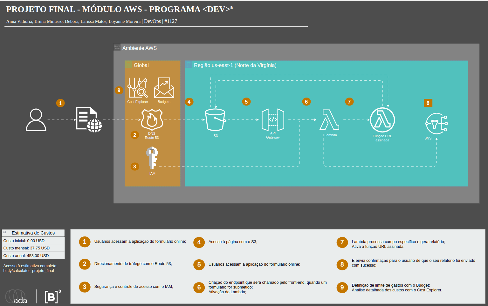

# Projeto de Upload de Relatórios com AWS

## Descrição

Este projeto implementa uma solução para o upload de relatórios usando a infraestrutura da AWS, garantindo resiliência, segurança e alta disponibilidade. A aplicação permite que usuários façam upload de arquivos de relatório através de uma interface web, enquanto o back-end processa e armazena esses arquivos de forma segura no AWS S3.

## Tecnologias Utilizadas

- **AWS S3**: Armazenamento dos arquivos de relatório e da página web estática.
- **AWS Lambda**: Processamento dos eventos de upload de arquivo.
- **AWS API Gateway**: Interface para as funções Lambda e gerenciamento das URLs pré-assinadas para uploads seguros.
- **AWS IAM**: Gerenciamento de acesso e políticas de segurança.
- **AWS SNS**: Gera notificações de confirmação de upload dos arquivos.
- **AWS Route 53**: Gerenciamento de DNS para a aplicação.
- **HTML/CSS/JavaScript**: Front-end para coleta de dados de usuário e upload de arquivos.

## Configuração e Execução

### Pré-Requisitos

Antes de iniciar, você precisará ter uma conta AWS configurada com as permissões adequadas para criar e gerenciar os serviços mencionados acima.

### Passos para Configuração

1. **Configurar o Bucket S3**:
   - Crie um bucket no S3 para armazenar os arquivos de relatório e a página web estática.
   - Configure as políticas de bucket para garantir acesso seguro e público do bucket.

2. **Deploy do AWS Lambda**:
   - Utilize as funções Lambda conforme apresentadas na pastar _src_ neste repositório para processar os uploads de arquivos.
   - Defina a trigger para essas funções a partir do API Gateway.

3. **Configuração do API Gateway**:
   - Configure um novo API Gateway para criar o endpoint que suas função Lambda usará.
   - Defina métodos POST para aceitar uploads e gerar URLs pré-assinadas.
   - Faça o deploy do stage e substitua a URL presente no script.js pela URL gerada no deploy.

4. **Configuração do SNS**:
   - Crie um novo tópico de fila padrão para gerenciar as notificações.
   - Faça uma nova inscrição com o e-mail da pessoa que irá submeter o envio dos arquivos.
   - Confirme na sua caixa de entrada a inscrição realizada para que os e-mails de confirmação sejam enviados.

5. **Configuração de IAM**:
   - Certifique-se de criar as políticas de IAM para gerenciar as permissões de acesso dos serviços AWS utilizados.

6. **DNS via Route 53**:
   - Configure o Route 53 para gerenciar o DNS da aplicação, apontando para o S3 e o API Gateway conforme necessário.

### Executando Localmente

Para executar a aplicação localmente, você precisará simular o ambiente AWS. 

## Contribuição

Sinta-se à vontade para contribuir para este projeto! Faça um fork do repositório, faça suas alterações e envie um pull request para a avaliação.

## Licença

Este projeto é distribuído sob a licença MIT. Veja o arquivo `LICENSE` no repositório para mais detalhes.

## Autores

- Bruna
- Debora
- Larissa
- Loyanne 

